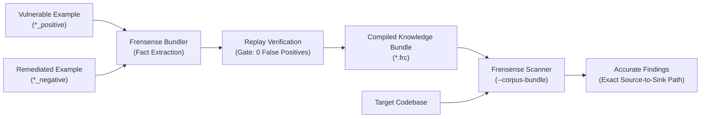

# Teachable Static Analysis

Traditional static analysis tools are built like rigid factories: to detect a new vulnerability pattern, someone has to rewrite the machine's internal gears or learn a specialized, obscure query language.

Frensense works differently. It was built with a clear separation between **how code is analyzed** and **what vulnerabilities look like**:

1. **The Engine** (`frensense-engine`): A compiler that parses code into an Intermediate Representation (IR), tracks how values move between variables, inspects branch conditions, and determines data reachability.
2. **The Knowledge Bundles** (`.frc` files): Portable, compiled bundles of security facts that tell the engine which functions are dangerous, which are safe, and what policies must be followed.

Because of this separation, **you do not need to write Rust, understand compiler theory, or recompile the engine** to teach Frensense new vulnerabilities.



---

## The Twin-Example Method: How Frensense Learns

To teach Frensense, you create a **family** consisting of two files:

- **`[name]_positive.[ext]`**: The vulnerable code containing the dangerous pattern.
- **`[name]_negative.[ext]`**: The safe version showing how the vulnerability was remediated.

### Why Twin Examples Work
When a security vulnerability occurs in production, an engineer writes a pull request to fix it. That pull request contains the exact difference between "dangerous" and "safe":
- Did they add an input validation check?
- Did they switch from raw string concatenation to a parameterized query?
- Did they invoke an authorization check before deleting a record?

The Frensense bundler automatically compares the positive and negative files, identifies what made the difference, and distills it into a **Learned Fact**.

---

## The 13 Teachable Subsystems

Under the hood, Frensense's knowledge system is categorized into 13 distinct security dimensions. Every dimension corresponds to an entry in the engine's `LearnedFactEntry` table:

### 1. Dangerous Sinks (`LearnedFactEntry::Sink`)
A "sink" is a function where untrusted data causes harm (such as executing a system command or running a database query).
- **What is taught**: Which argument slot is dangerous.
- **Real-world benefit**: In `cursor.execute(sql, params)`, slot 0 (`sql`) is dangerous, but slot 1 (`params`) is a safe parameterized binding channel. The engine learns not to flag parameterized queries.

### 2. Untrusted Sources (`LearnedFactEntry::Source`)
A "source" is any place where untrusted user data enters your application.
- **What is taught**: Function calls or object properties that deliver user data (e.g., `request.cookies.get`, `request.body.json`, or custom RPC gateways).

### 3. Sanitizers (`LearnedFactEntry::Sanitizer`)
A "sanitizer" is a function that cleanses data or renders it harmless.
- **What is taught**: Escaping helpers (e.g. `html.escape()`, `quote_plus()`) or type coercions (`int()`, `float()`) that remove risk.

### 4. Data Propagators (`LearnedFactEntry::Propagator`)
A "propagator" transforms data while preserving its untrusted nature.
- **What is taught**: Encoding/decoding helpers like `base64.b64decode`, string formatters, or array manipulation functions.

### 5. Security Policies (`LearnedFactEntry::Policy`)
Policies enforce that certain security checks must happen in the same function or module as a sensitive operation.
- **What is taught**: "Whenever function `delete_user()` is called, function `verify_admin_role()` must precede it."

### 6. Non-Dataflow Checks (`LearnedFactEntry::Check`)
Direct code structure inspection that does not require tracking variable flows.
- **What is taught**: Detecting calls to deprecated APIs or configuration functions missing mandatory flags.

### 7. Memory Contracts (`LearnedFactEntry::MemoryContract`)
Tracks heap allocation and deallocation across boundaries in systems languages (C, C++, Rust).
- **What is taught**: Which functions allocate new memory and which functions consume/free pointers, preventing use-after-free bugs.

### 8. Cryptographic Standards (`LearnedFactEntry::WeakCrypto`)
Enforces corporate cryptography standards.
- **What is taught**: Flagging weak hash algorithms (`md5`, `sha1`, `des`) while allowing secure algorithms (`sha256`, `argon2id`).

### 9. Authorization Guards (`LearnedFactEntry::GuardBypass`)
Recognizes authorization and containment checks.
- **What is taught**: Helper functions that validate whether a requested resource belongs to the current user or tenant.

### 10. Schema Validation (`LearnedFactEntry::SchemaPolicy`)
Recognizes input validation frameworks (such as Zod, Yup, or Pydantic).
- **What is taught**: Acknowledging that data passing through schema validator methods is validated.

### 11. Syntax Roles (`LearnedFactEntry::GrammarRole`)
Teaches the parser how new or unusual language syntax functions without modifying the engine.
- **What is taught**: Mapping language AST nodes to functions, variables, or call expressions dynamically.

### 12. Syntax Features (`LearnedFactEntry::GrammarFeature`)
Teaches language idioms like object destructuring, template literals, and ternary operators.
- **What is taught**: Enabling accurate variable tracking through modern JavaScript or Python language features.

### 13. Access Control & Multi-Tenancy (`LearnedFactEntry::IdorFinderSink`)
Detects Insecure Direct Object References (IDOR).
- **What is taught**: Database query methods and required multi-tenant ownership keys (e.g., `account_id`, `tenant_id`).

---

## Step-by-Step: How to Teach Frensense in Practice

### Step 1: Create a Corpus Folder
Create a directory with positive and negative code snippets:

```bash
mkdir -p my_corpus/custom_auth
```

Create `custom_auth_positive.py` (the bug):
```python
# VULNERABLE: Direct lookup without tenant scoping
def get_invoice(req):
    invoice_id = req.args.get("id")
    return db.query_invoice(invoice_id)
```

Create `custom_auth_negative.py` (the fix):
```python
# SAFE: Scoped lookup requiring active organization ID
def get_invoice(req):
    invoice_id = req.args.get("id")
    org_id = req.session.get("org_id")
    return db.query_invoice(invoice_id, org_id=org_id)
```

### Step 2: Build the Bundle
Run the Frensense bundler tool:

```bash
frensense-bundler my_corpus my_company.frc
```

The bundler extracts the fact, executes the **replay verification gate** across both files, and outputs a binary `my_company.frc` knowledge bundle.

### Step 3: Scan with Your Knowledge Bundle
Provide the bundle to the scanner:

```bash
frensense src/ --corpus-bundle my_company.frc
```

Or drop `frensense-corpus.frc` directly into the root directory of your project; Frensense will discover and load it automatically.

---

## Frequently Asked Questions

### Do I need to know Rust to teach Frensense?
**No.** All training examples are written in the target language of your application (Python, TypeScript, JavaScript, Go, C, Rust). The bundler handles all analysis and translation into binary knowledge bundles.

### What happens if a learned rule conflicts with built-in rules?
Knowledge bundles are designed with safe precedence:
- **Learned facts win on specific knowledge**: If a bundle teaches that a specific parameter is safe, that precision overrides generic defaults.
- **Narrow facts cannot be widened**: A generic rule cannot overwrite a precise, slot-restricted signature.

### How does Frensense prevent false alarms from learned rules?
Before any rule is written into an `.frc` bundle, it must pass the **Replay Gate**. The candidate rule is tested against all negative examples in the corpus. If it causes even a single false positive on safe code, the bundler rejects it.
